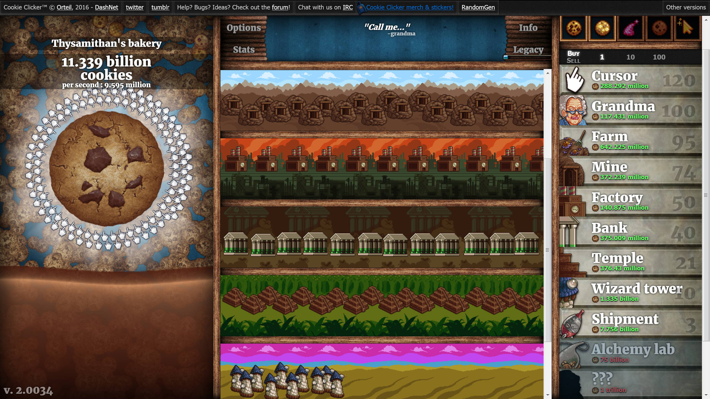

# Cookie Clicker Automation



## Introduction
Welcome to the Cookie Clicker Automation Python program! This script leverages Selenium WebDriver to streamline your Cookie Clicker experience, allowing you to focus on strategic decisions while automating routine tasks. This README provides insights into the program's features, settings, installation, and more.

## Features and Settings

### Customization Options
Tailor the automation to your preferences with the following settings in the `settings.py` file:

- **Browser Selection:** Choose your preferred browser from options including 'Firefox,' 'Chrome,' 'Edge,' or 'Safari.'

- **Early Sugar Lump Harvest:** Enable this option to potentially harvest sugar lumps three hours earlier, with a 50% chance.

- **Golden/Warth Cookie Collection:** Toggle to decide whether the program should automatically obtain the Golden Wraith Cookie. Disable this during the Grandmapocalypse for optimal gameplay.

- **Grandmapocalypse Toggle:** Personalize your experience by choosing whether to end the Grandmapocalypse event or not.

- **Wizard Tower Bonus:** Set the wizard bonus to 'Force the Hand of Fate,' 'Conjure Baked Goods,' or 'Spontaneous Edifice' based on your strategy.

### Main Program Actions
The `automate.py` script performs the following actions:

- **Click Big Cookie:** The program will automatically click the big cookie, as any automate program, ensuring continuous progress and lots of cookies.

- **Golden Cookie Interaction:** Seize the opportunity by automatically clicking on golden cookies.

- **Sugar Lump Harvesting:** Efficiently harvest sugar lumps when available.

- **Shop Upgrades:** Automatically purchase shop upgrades to enhance your cookie production.

- **Building Purchases:** Streamline the process of acquiring new buildings for accelerated progress.

- **Wizard Tower Buff Application:** Utilize the wizard tower buff based on the selected bonus.

- **Progress Tracking:** Save your progress to the 'save.txt' file for future use.

## Dependencies
Ensure you have the following dependencies installed:

- Python 3
- Pip

## Installation
Follow these steps to set up the Cookie Clicker Automation:


   ```bash
    pip install selenium
    git clone https://github.com/RedeemedSpoon/Cookie-Clicker-Automate.git
    cd Cookie-Clicker-Automate/

## How to Use
1. **Configure Settings:**
   Adjust settings in the `settings.py` file to match your preferences.

2. **Run the Automation Script:**
   ```bash
   python3 automate.py

  ### Manual Interaction:
  If you ever want to transfer your game to another browser or play it alone without automation, follow these additional steps:
  
  **Get Game Progress:**
  
  In the program directory 'Cookie-Clicker-Automate', open save.txt and copy the whole text in it.
  
  **Import to Your Browser:**
  
  On your browser, open cookie clicker website, navigate to the option tab, locate the import button, and paste the previous text. This will load your game into the browser.
  
  **Update save.txt:**
  
  Copy the new game's export text from the export button in the option tab and overwrite the content in the save.txt file. This ensures that the automation script has the latest game state.

## Important Note

Use this program moderately to maintain fairness in the game. Excessive automation may impact the intended game experience. Strive for a balanced approach to enjoy Cookie Clicker to its fullest.
## License

This project is licensed under the MIT License.
## Contribution

Your contributions are valuable! Feel free to open issues or submit pull requests to enhance the functionality of this automation script. Together, we can improve the Cookie Clicker Automation experience for everyone.
